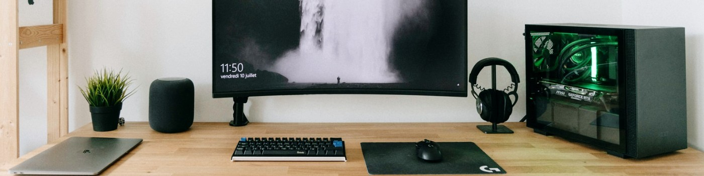

  
### Hi there 👋, my name is Daniel
#### I am just your friendly tech guy :grin:

A bit about my self:

**Skills**: Web development using Javascript & Typescript, on the mostly working on the backend side using Nest.js framework and rarely on the client facing side using React.js & Angular. I love automation and was blown away when shown how automation for cloud deployments works with terraform at first sight!

- 🔭 I’m currently working educating myself more on the devOps side of the software world :) 
- 👯 I’m looking to collaborate on open source projects that make impact if times permit 
- 🤔 I’m looking for help with technical reviewing of medium stories I am writing 
- 💬 Ask me about literally everything. I believe honesty is key is our lives. I am really interested about software architecture, finance and economy and sustainable living   
- 📫 How to reach me: on every platform of your choosing from the below links

<!-- contact options / clickable icons -->
          

  

  

  

  

